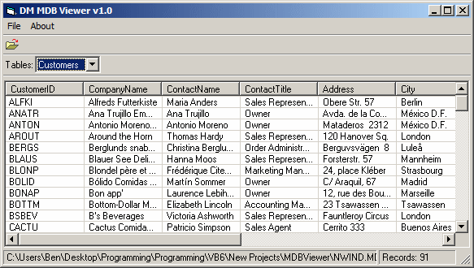



## DM MDB Viewer

### Description

Hi, this is a small example of using DAO to view a database without access, it very basic and should be handy for a beginner shows how to get all the tables and load them into a Listview, anyway I hope you may find some use of the code.
 
### More Info
 

             |
---                |---
**Submitted On**   |2008-10-12 17:01:22
**By**             |[dreamvb](https://github.com/Planet-Source-Code/PSCIndex/blob/master/ByAuthor/dreamvb.md)
**Level**          |Beginner
**User Rating**    |5.0 (25 globes from 5 users)
**Compatibility**  |VB 6\.0
**Category**       |[Databases/ Data Access/ DAO/ ADO](https://github.com/Planet-Source-Code/PSCIndex/blob/master/ByCategory/databases-data-access-dao-ado__1-6.md)
**World**          |[Visual Basic](https://github.com/Planet-Source-Code/PSCIndex/blob/master/ByWorld/visual-basic.md)
**Archive File**   |[DM\_MDB\_Vie21386812312008\.zip](https://github.com/Planet-Source-Code/dreamvb-dm-mdb-viewer__1-71588/archive/master.zip)

